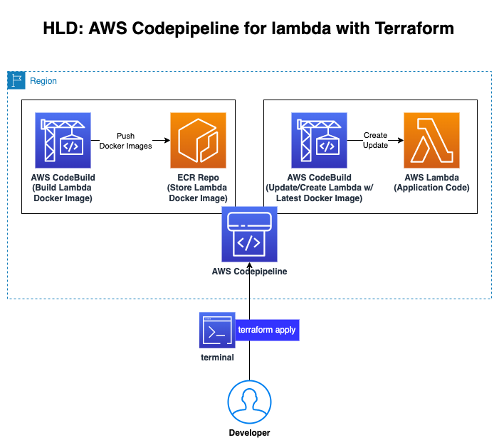

# Create a AWS Codepipeline with Terraform

This demonstration is to show how to create a Codepipeline in AWS using Terraform.

# Implementation

## HLD



We will be provisioning AWS Codepipeline and its supporting AWS Services like `AWS Codbuild` and `AWS CodeCommit` and `AWS ECR` and finally using the provisioned codepipeline to provision lambda resource and deploy a sample lambda application `ref folder: lambda_bootstrap` into AWS.

## Pre-requisites

1. Install Terraform : [link](https://learn.hashicorp.com/tutorials/terraform/install-cli)
2. Install AWS CLI : [link](https://docs.aws.amazon.com/cli/latest/userguide/getting-started-install.html)
3. Configure AWS CLI with AWS Account do `aws sts get-caller-identity` for validation) : [link](https://docs.aws.amazon.com/cli/latest/userguide/cli-chap-configure.html)

## Folder Structure

```
.
|-- img
|   |-- codepipeline-output.png
|   `-- codepipeline-using-terraform.png
|-- lambda_bootstrap
|   |-- lambda
|   |   |-- Dockerfile
|   |   |-- aws-lambda-url.py
|   |   |-- docker-test.sh
|   |   `-- requirements.txt
|   |-- main.tf
|   |-- outputs.tf
|   |-- providers.tf
|   |-- terraform.tfvars
|   |-- variables.tf
|   `-- versions.tf
|-- terraform
|   |-- modules
|   |   |-- codecommit
|   |   |   |-- main.tf
|   |   |   |-- outputs.tf
|   |   |   `-- variables.tf
|   |   |-- codepipeline
|   |   |   |-- templates
|   |   |   |   |-- buildspec_build.yml
|   |   |   |   `-- buildspec_deploy.yml
|   |   |   |-- main.tf
|   |   |   |-- outputs.tf
|   |   |   |-- roles.tf
|   |   |   `-- variables.tf
|   |   `-- ecr
|   |       |-- main.tf
|   |       |-- outputs.tf
|   |       `-- variables.tf
|   |-- main.tf
|   |-- outputs.tf
|   |-- providers.tf
|   |-- terraform.tfvars
|   |-- variables.tf
|   `-- versions.tf
`-- README.md
```

## Provision Infrastructre

1. `cd create-codepipeline-using-terraform/terraform`
2. run `terraform init`
3. run `terraform validate`
4. run `terraform plan`  and review the output in `terminal`
5. run `terraform apply` and review the output in `terminal` and when ready, type `yes` and hit enter
6. you should be seeing output simillar to this:

   ```
   Apply complete! Resources: 11 added, 0 changed, 0 destroyed.

   Outputs:

   codecommit = "https://git-codecommit.us-east-1.amazonaws.com/v1/repos/cloudcomps_devops_tf123_code_repo"

   codepipeline = "arn:aws:codepipeline:us-east-1:<account#>:cloudcomps_devops_tf123_dev_pipeline"

   ecrrepo = "<account#>.dkr.ecr.us-east-1.amazonaws.com/cloudcomps_devops_tf123_docker_repo"
   ```

7. run `cd..` into the root folder and copy the `codecommit` info from above output.
8. run `git clone <https://git-codecommit.us-east-1.amazonaws.com/v1/repos/cloudcomps_devops_tf123_code_repo>`
9. If credentials are required, Generate a CodeCommit credentials from `aws console` for the IAM user that you logged in:
   1. Select `Users` from IAM (Access Management Tab)
   2. Select the user that you want to provide CodeCommit Access to.
   3. Select `Security Credentials` from the User information panel.
   4. Scroll down and you should be seeing a subsection `HTTPS Git credentials for AWS CodeCommit`
   5. Click on `Generate Credentials`, you should be prompted with Download credentails in cvs file.
10. Once git clone and git authentication is sucessfull, cd to cloned directory `cloudcomps_devops_tf123_code_repo`
11. copy lambda application code from `lambda_bootstrap` folder to git repo by running `cp -R lambda_bootstrap cloudcomps_devops_tf123_code_repo/`
12. go to cloned repo `cd cloudcomps_devops_tf123_code_repo`
13. push the changes to git repo by running `git add. && git commit -m "Initial Commit" && git push`
14. Thats it!, you can now navigate to AWS Codepipeline from `aws console` and check the pipeline status.
15. If everything goes well, you should be seeing an output simillar to this:   

Reference links:

1. AWS Codepipeline : <https://registry.terraform.io/providers/hashicorp/aws/latest/docs/resources/codepipeline>
2. AWS CodeBuild: <https://registry.terraform.io/providers/hashicorp/aws/latest/docs/resources/codebuild_project>
3. AWS CodeCommit: <https://registry.terraform.io/providers/hashicorp/aws/latest/docs/resources/codecommit_repository>
4. AWS ECR: <https://registry.terraform.io/providers/hashicorp/aws/latest/docs/resources/ecr_repository>
5. Terraform Output Values: <https://www.terraform.io/language/values/outputs>

## Security

See [CONTRIBUTING](CONTRIBUTING.md#security-issue-notifications) for more information.

## License

This library is licensed under the MIT-0 License. See the LICENSE file.

